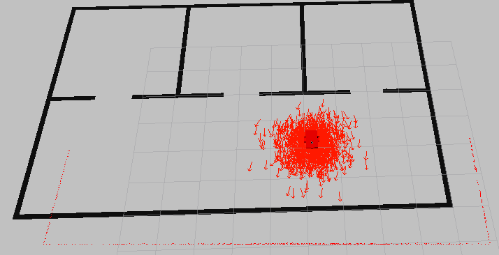
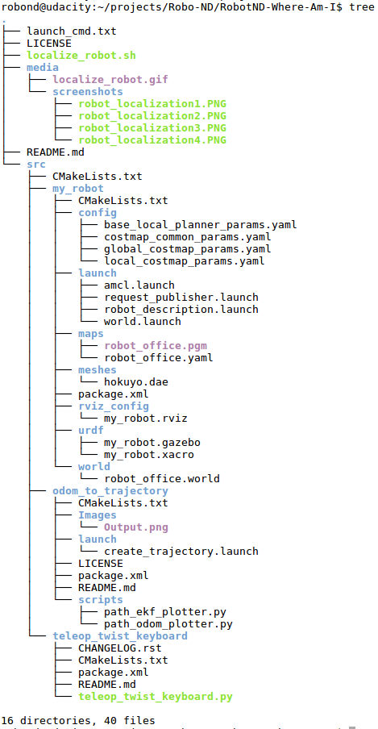

# Robotics : Where Am I!
A robot follows commands on the keyboard to move into a new pose. During the movement, the robot estimates its pose using the [Monte Carlo Localization](http://wiki.ros.org/amcl) which uses a particle filter. The program runs in the robot simulation [Gazebo](http://gazebosim.org/) and using the robot operating system [ROS]( https://www.ros.org/).
    
This project is part of my robotics nano degree of[ Udacity](https://www.udacity.com/course/robotics-software-engineer--nd209). 

### Example: A robot localize its pose


<br>

## Important files
- /my_robot/* : the robot and building model
- /odom_to_trajectory/* : the ROS package with the odometry
- /teleop_twist_keyboard/*: The ROS package to send movement commands to the robot via the keyboard.


### Project tree
 

<br>
  
## Installation and usage
***The application runs on Ubuntu with ROS installed.***

Clone the repository
```sh
$ cd <your workspace folder>
$ git clone https://github.com/embmike/RobotND-Where-Am-I.git
```
 
Build packages
```sh
$ cd /<your workspace folder>/RobotND-Where-Am-I/
$ catkin_make
```
 
Launch the robot inside the world and run drive_bot
```sh
$ cd /<your workspace folder>/RobotND-Where-Am-I/
$ chmod +x cd localize_robot.sh
$ ./localize_robot.sh
```

Now use the keyboard to send movement commands to the robot to move the robot. 
In the end, all of the particles are in a lump on the robot, so that the robot pose can be accurately estimated.
```sh
	---------------------------
	Moving around:
	   u    i    o
	   j    k    l
	   m    ,    .

	q/z : increase/decrease max speeds by 10%
	w/x : increase/decrease only linear speed by 10%
	e/c : increase/decrease only angular speed by 10%
	anything else : stop
```
<br>

## Licence
This project is licensed under the terms of the [](https://opensource.org/licenses/MIT)
